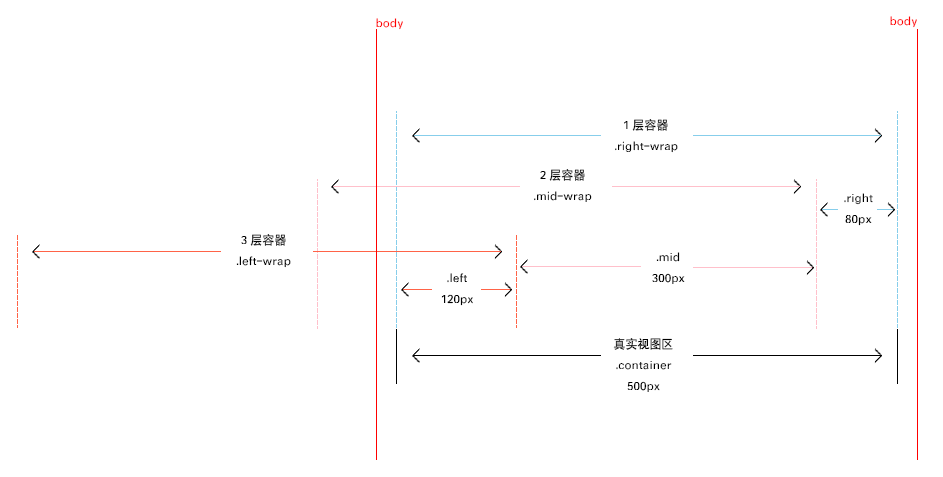

title: '多栏布局'
date: 2017-1-18 20:57:42
tags: [CSS]

---

现在很少接触到太多的 CSS 问题了，多数情况下 flex 都是最佳的选择，慢慢也就对基础生疏了，今天来总结下常见的布局问题。示例中关于 flex 的布局都比较简单，不理解的需要重新补习 [flex](/blog/2016/05/04/flex布局/) 基础。本文中的示例和代码都在 [codepen](https://codepen.io) 上，如果加载异常请先科学上网。

具有固定宽高的布局方式在实际需求中其实很少见，一般都会有自适应的区域，接下来就来看看常用的几种布局。

<!-- more -->

## 两栏布局

常见的两栏布局一般是左侧固定，右侧自适应。

1. float
   <iframe height='162' scrolling='no' title='两栏布局 - float' src='https://codepen.io/cnzsb/embed/XpXxKj/?height=162&theme-id=0&default-tab=css,result&embed-version=2' frameborder='no' allowtransparency='true' allowfullscreen='true' style='width: 100%;'>See the Pen <a href='https://codepen.io/cnzsb/pen/XpXxKj/'>两栏布局 - float</a> by Shibo Zhao (<a href='https://codepen.io/cnzsb'>@cnzsb</a>) on <a href='https://codepen.io'>CodePen</a>.
   </iframe>

2. position
   <iframe height='183' scrolling='no' title='两栏布局 - position' src='https://codepen.io/cnzsb/embed/xgZyXX/?height=183&theme-id=0&default-tab=css,result&embed-version=2' frameborder='no' allowtransparency='true' allowfullscreen='true' style='width: 100%;'>See the Pen <a href='https://codepen.io/cnzsb/pen/xgZyXX/'>两栏布局 - position</a> by Shibo Zhao (<a href='https://codepen.io/cnzsb'>@cnzsb</a>) on <a href='https://codepen.io'>CodePen</a>.
   </iframe>

3. table-cell
   <iframe height='179' scrolling='no' title='两栏布局 - table-cell' src='https://codepen.io/cnzsb/embed/OWXJaM/?height=179&theme-id=0&default-tab=css,result&embed-version=2' frameborder='no' allowtransparency='true' allowfullscreen='true' style='width: 100%;'>See the Pen <a href='https://codepen.io/cnzsb/pen/OWXJaM/'>两栏布局 - table-cell</a> by Shibo Zhao (<a href='https://codepen.io/cnzsb'>@cnzsb</a>) on <a href='https://codepen.io'>CodePen</a>.
   </iframe>

4. flex
   <iframe height='227' scrolling='no' title='两侧定宽，中间自适应 - flex' src='https://codepen.io/cnzsb/embed/dNMZWa/?height=227&theme-id=0&default-tab=css,result&embed-version=2' frameborder='no' allowtransparency='true' allowfullscreen='true' style='width: 100%;'>See the Pen <a href='https://codepen.io/cnzsb/pen/dNMZWa/'>两侧定宽，中间自适应 - flex</a> by Shibo Zhao (<a href='https://codepen.io/cnzsb'>@cnzsb</a>) on <a href='https://codepen.io'>CodePen</a>.
   </iframe>

## 三栏布局

简单的三栏布局可以拆分成两栏布局嵌套两栏布局的方式设计，在此基础上如果拆分为中间元素和两侧元素的话，则需要真正的三栏布局来设计了。

首先是左右固定，中间自适应的布局。

1. float
   <iframe height='201' scrolling='no' title='两侧定宽，中间自适应 - float' src='https://codepen.io/cnzsb/embed/GroYQz/?height=201&theme-id=0&default-tab=css,result&embed-version=2' frameborder='no' allowtransparency='true' allowfullscreen='true' style='width: 100%;'>See the Pen <a href='https://codepen.io/cnzsb/pen/GroYQz/'>两侧定宽，中间自适应 - float</a> by Shibo Zhao (<a href='https://codepen.io/cnzsb'>@cnzsb</a>) on <a href='https://codepen.io'>CodePen</a>.
   </iframe>

2. float + margin 负值，两栏布局也可以采用这种方法
   <iframe height='257' scrolling='no' title='两侧定宽，中间自适应 - float + margin 负值' src='https://codepen.io/cnzsb/embed/ygeQMz/?height=257&theme-id=0&default-tab=css,result&embed-version=2' frameborder='no' allowtransparency='true' allowfullscreen='true' style='width: 100%;'>See the Pen <a href='https://codepen.io/cnzsb/pen/ygeQMz/'>两侧定宽，中间自适应 - float + margin 负值</a> by Shibo Zhao (<a href='https://codepen.io/cnzsb'>@cnzsb</a>) on <a href='https://codepen.io'>CodePen</a>.
   </iframe>

3. position
   <iframe height='246' scrolling='no' title='两侧定宽，中间自适应 - position' src='https://codepen.io/cnzsb/embed/dNGgxw/?height=246&theme-id=0&default-tab=css,result&embed-version=2' frameborder='no' allowtransparency='true' allowfullscreen='true' style='width: 100%;'>See the Pen <a href='https://codepen.io/cnzsb/pen/dNGgxw/'>两侧定宽，中间自适应 - position</a> by Shibo Zhao (<a href='https://codepen.io/cnzsb'>@cnzsb</a>) on <a href='https://codepen.io'>CodePen</a>.
   </iframe>

4. flex
   <iframe height='232' scrolling='no' title='两侧定宽，中间自适应 - flex' src='https://codepen.io/cnzsb/embed/dNMZWa/?height=232&theme-id=0&default-tab=css,result&embed-version=2' frameborder='no' allowtransparency='true' allowfullscreen='true' style='width: 100%;'>See the Pen <a href='https://codepen.io/cnzsb/pen/dNMZWa/'>两侧定宽，中间自适应 - flex</a> by Shibo Zhao (<a href='https://codepen.io/cnzsb'>@cnzsb</a>) on <a href='https://codepen.io'>CodePen</a>.
   </iframe>

另一种是中间定宽，两侧自适应的布局。这个情况需要在固定中间元素的前提下，使左右两侧浮动或者绝对定位即可，下例使用 float 做了演示，同上述例子类似，float 的元素也可以使用 position 进行绝对定位替换，这里不再演示。
<iframe height='268' scrolling='no' title='中间定宽，两侧自适应 - float + position' src='https://codepen.io/cnzsb/embed/oBLjGQ/?height=268&theme-id=0&default-tab=css,result&embed-version=2' frameborder='no' allowtransparency='true' allowfullscreen='true' style='width: 100%;'>See the Pen <a href='https://codepen.io/cnzsb/pen/oBLjGQ/'>中间定宽，两侧自适应 - float + position</a> by Shibo Zhao (<a href='https://codepen.io/cnzsb'>@cnzsb</a>) on <a href='https://codepen.io'>CodePen</a>.
</iframe>

## 等高布局

等高布局是一种要求各栏背景颜色填充至等高的样式。

1. 两栏等高
<iframe height='189' scrolling='no' title='两栏等高布局' src='https://codepen.io/cnzsb/embed/BpQZNq/?height=189&theme-id=0&default-tab=css,result&embed-version=2' frameborder='no' allowtransparency='true' allowfullscreen='true' style='width: 100%;'>See the Pen <a href='https://codepen.io/cnzsb/pen/BpQZNq/'>两栏等高布局</a> by Shibo Zhao (<a href='https://codepen.io/cnzsb'>@cnzsb</a>) on <a href='https://codepen.io'>CodePen</a>.
</iframe>

2. 三栏等高
<iframe height='320' scrolling='no' title='三栏等高布局' src='https://codepen.io/cnzsb/embed/OWbjyJ/?height=320&theme-id=0&default-tab=css,result&embed-version=2' frameborder='no' allowtransparency='true' allowfullscreen='true' style='width: 100%;'>See the Pen <a href='https://codepen.io/cnzsb/pen/OWbjyJ/'>三栏等高布局</a> by Shibo Zhao (<a href='https://codepen.io/cnzsb'>@cnzsb</a>) on <a href='https://codepen.io'>CodePen</a>.
</iframe>

以上布局如果需要流式布局，宽度替换为百分比即可。关于三栏等高布局，根据上例下图能帮助很好的理解。其中主要利用了相对定位的方式，2 层容器的 right 距离为第三栏（最右栏）元素的宽度，3 层容器的 right 距离为第二栏（中间栏）的宽度；对于子栏目来讲，它们的 left 距离均为除了第一栏（最左栏）的宽度之和。理解了原理之后，根据需要，扩展更多的子栏也可以运用同样的方式。

## 小结

本文仅仅展示了几种常见的布局结构以及对应的常用方法，自适应的布局在页面重构中很经常遇到，需要加强更多的响应式知识才能熟练。

## 参考资料

1. [两栏布局，三栏布局，等高布局，流式布局](https://www.cnblogs.com/jununx/p/3336553.html)
2. [八种创建等高列布局](https://www.w3cplus.com/css/creaet-equal-height-columns)
